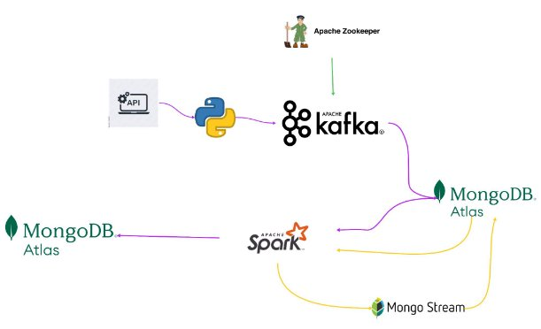

**Project Architecture**

- **The goal of the project**
- In our project, a continuous data flow was provided via Apache Kafka with historical and current data received from financial markets. Market trends were analyzed and predictions were made for future movements using Apache Spark. MongoDB has been used to store market data and forecast results
- **Method and Technologies Used**
- The project was developed using the Python programming language. Python's powerful libraries and wide community support met various data processing and web development needs in this project. The main technologies used are:
- **Apache Kafka** It is an open source distributed messaging system used to process and manage high volumes of data streams in real time. Thanks to its high scalability and durability features, it is preferred in various usage scenarios such as data integration, event streaming and real-time analysis. We received stock market data in the project. api’den communication and real-time analysis of incoming data with other services via Kafka used.
- **MongoDB** It was used as a database, where financial data was kept in an organized form, and was positioned between Kafka and Spark to create a data warehouse for real-time analysis. It was also used to store the analysis result of the data in dataframe format returned as a result of the analysis. Additionally, realtime database was monitored with Mongo watch collection watch.
- **Apache Spark** It is a fast and general-purpose open source distributed computing engine developed for big data processing. It was used in the project to analyze real-time financial data and performs market trend analysis and price prediction.
- **Confluent** Confluent offers a variety of tools, services and extensions to make using Kafka easier and more effective. Confluent's The features it provides include advanced management and monitoring tools, security features, data integration tools and cloud-based solutions. This makes it possible to manage and analyze large-scale data flows more efficiently.
